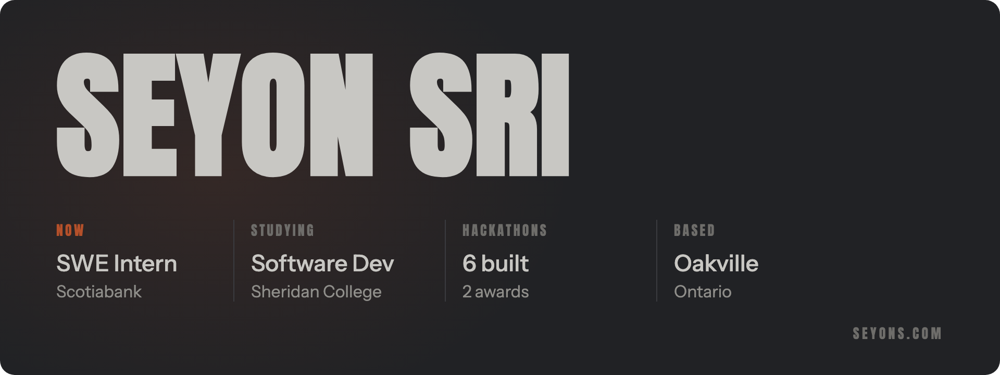

Software Engineer Intern at Scotiabank. Software Development and Network Engineering at Sheridan College.

I build AI and full-stack apps, mostly at hackathons.

### Builds

| | What it is | Where | Stack |
|---|---|---|---|
| [**HemoStat**](https://github.com/CommunityHackathons/HemoStat) | Four agents that watch Docker containers, find the root cause and fix them | DevOps for GenAI 2025 **Most Impactful Award** | Python, LangChain, Docker, Redis, Prometheus, Grafana |
| **ThyroTrack** | Thyroid health tracker with an XGBoost model | AI in Healthcare 2025 **2nd place** | Python, XGBoost |
| [**StanCut**](https://github.com/S3yon/StanCut) | Native iOS app, my first Swift project | Stan x HackAI Toronto 2026 **Top 6** | Swift, AWS Lambda, S3 |
| [**Outfitted**](https://github.com/S3yon/Outfitted) | Upload your clothes, get a digital closet and outfit ideas | Hack Canada 2026 | TypeScript, Gemini, Cloudinary, Auth0 |
| [**PriceValve**](https://github.com/rick-mingyu-liu/PriceValve) | Steam pricing dashboard for indie game developers | SpurHacks 2025 | Next.js, TypeScript, Express, Steam API |
| [**404cast**](https://github.com/vega0604/404cast) | Guess-the-neighbourhood safety game on Toronto Police crime data | Hack404 2025 | React, Node, Express, MongoDB, Google Maps |
| [**skill-kit**](https://github.com/S3yon/skill-kit) | Three agent skills in one plugin: variant-lab, writing-check, quiz | Side project | Python |
| [**seyons.com**](https://github.com/S3yon/S3yon.com) | My personal site | Side project | Next.js, TypeScript, Tailwind |

The hackathon builds were team projects.

### Stack

Python, TypeScript, Java, SQL, Swift · PyTorch, scikit-learn, XGBoost, LangChain · React, Next.js, Node, FastAPI · Docker, AWS, Google Cloud, Vercel

### Off the keyboard

I shoot events and headshots. Lead Photographer at GDG Sheridan, photo team at Hack the North 2026, marketing lead for BearHacks, executive at the Sheridan Computer Science Club.

[seyons.com](https://www.seyons.com) · [LinkedIn](https://www.linkedin.com/in/seyon-sri/) · [X](https://x.com/s3yon_) · [Devpost](https://devpost.com/S3yon)
